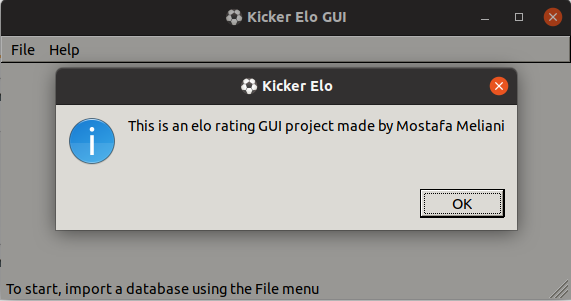
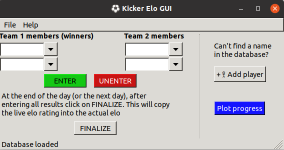
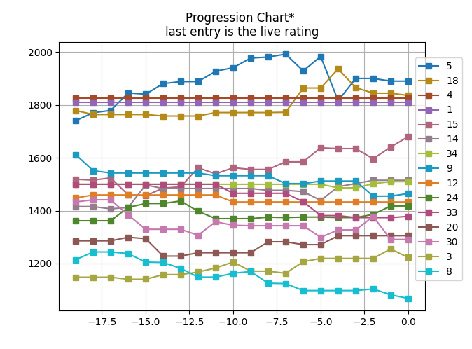

On this page, I intend to share primarily non-academic content

### KICKER ELO PROJECT
This Kicker elo project started when, at the math department in Nijmegen, PhD students had access to a kicker table during the breaks. To have a bit of friendly competition I created an elo system for the players. The mathematics of it is very much copied from the original system developed by Arpad Elo for chess with a small modification intended to adapt it for the 2v2 format of kicker. That is the elo of a team is the arithmetic mean of its two players.

Here is a snapshot of the standing on Nov 23rd, 2023. The names of the palyers have been hidden. 

